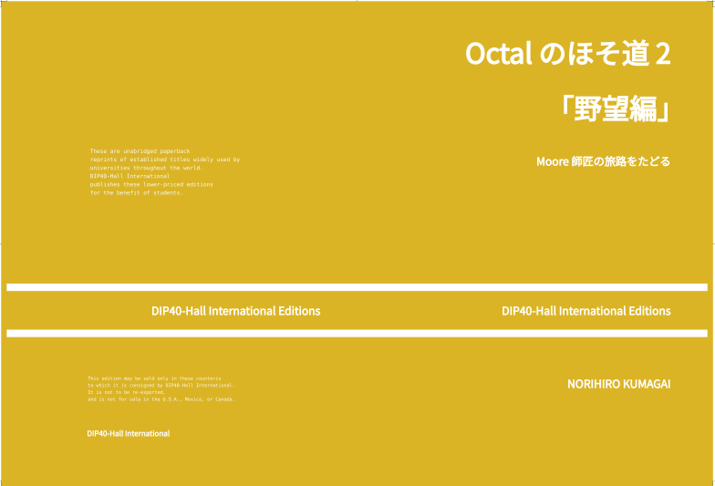

## カバーページ

* 表紙を作る。
* 萌え絵を用意して貼ることが望ましいが、そんな画才はない。
* なので文字のみで表紙を構成している。

### 箱並べ

* gridを使い倒して箱並べを行う。
* 表紙は流し込みがなく、決まった文字列を決まった位置にならべるだけである。
* 「Octalの細道2 『野望編』」の表紙は以下の通り



```html

<!-- left page, back page -->
<div id="container">
  <div id="topL">
    <pre class="back-center">
    These are unabridged paperback
    reprints of established titles widely used by
    universities throughout the world.
    DIP40-Hall International
    publishes these lower-priced editions
    for the benefit of students.
    </pre>
  </div>
  <div id="middleL">
    <section class="horizontal-bars">
    <section><div class="publisher">
    DIP40-Hall International Editions
    </div></section>
    </section>
  </div>
  <div id="bottomL">
    <pre class="back-bottom">
    This edition may be sold only in these counteris
    to which it is consigned by DIP40-Hall International.
    It is not to be re-exported,
    and is not for sale in the U.S.A., Mexico, or Canada.
    </pre>
    <pre class="back-publisher">
    DIP40-Hall International
    </pre>
  </div>
  <div id="topR">
    <section><div class="title">
    Octal のほそ道2 <br>「野望編」</div></section>
    <section><div class="subtitle">
    Moore師匠の旅路をたどる</div></section>
  </div>
  <div id="middleR">
    <section class="horizontal-bars">
      <section><div class="publisher">
      DIP40-Hall International Editions
      </div></section>
    </section>
  </div>
  <div id="bottomR">
    <section><div class="author">
    NORIHIRO KUMAGAI</div></section>
  </div>
```

CSSスタイルファイルに寸法情報書きまくりだが、別にクラス化する必要もあるまい。今なら以下のように、タグ内部に `style`属性で全部指定してしまうだろう。

TOBEPREPARED
